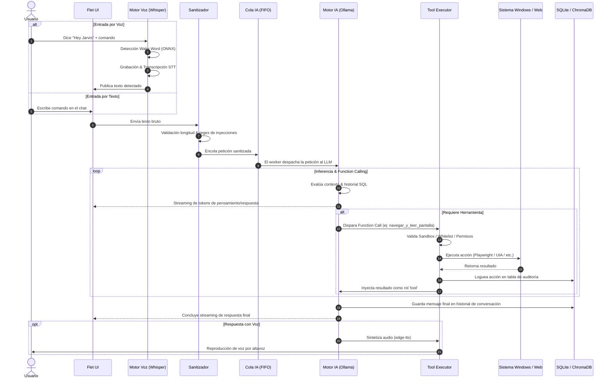

# 🏛️ Arquitectura del Sistema Agéntico: Reaxy$ (Jarvis OS)

> **Documento de Arquitectura Técnica y Flujo de Ejecución**  
> **Versión:** 2.0 (Post-Refactorización Modular & Zero-Trust)  
> **Entorno de Ejecución:** Windows 10/11 | Local-First & Privacy-Focused  

---

## 1. Visión General del Sistema

**Reaxy$** (núcleo agéntico **Jarvis**) es un sistema operativo agéntico local diseñado para ejecutarse sobre Windows. Proporciona una interfaz híbrida (Gráfica + Multimodal por Voz + Ejecución Autónoma en Background) capaz de razonar, interactuar con el entorno de escritorio, inspeccionar la web y el navegador, y orquestar flujos de trabajo autónomos sin depender de nubes externas para la inferencia ni comprometer la integridad del sistema operativo anfitrión.

El sistema implementa una arquitectura desacoplada basada en micro-módulos, con protección perimetral de **Zero Trust**, serialización de llamadas a hardware/VRAM y ejecución controlada mediante **Function Calling**.

```
                   ┌────────────────────────────────────────┐
                   │           USUARIO / ENTORNO            │
                   └───────────────────┬────────────────────┘
                                       │
            ┌──────────────────────────┴──────────────────────────┐
            ▼                                                     ▼
┌────────────────────────┐                             ┌────────────────────────┐
│  Voz / Multimodal      │                             │   UI Gráfica (Flet)    │
│  - Wake Word (ONNX)    │                             │   - Neo-brutalism      │
│  - STT: Faster-Whisper │                             │   - PubSub reactivo    │
│  - TTS: Edge-TTS       │                             │   - Control de sesión  │
└───────────┬────────────┘                             └───────────┬────────────┘
            │                                                     │
            └──────────────────────────┬──────────────────────────┘
                                       ▼
                     ┌───────────────────────────────────┐
                     │   Sanitizador Anti-Prompt-Inj     │ (SEC-11: 3 Capas)
                     └─────────────────┬─────────────────┘
                                       ▼
                     ┌───────────────────────────────────┐
                     │  Cola de Peticiones IA (FIFO)     │ (ESC-09: VRAM Guard)
                     └─────────────────┬─────────────────┘
                                       ▼
                     ┌───────────────────────────────────┐
                     │    Motor de IA (ia_engine.py)     │ (Ollama: qwen3:8b)
                     └─────────┬───────────────────┬─────┘
                               │                   │
                     (Respuesta Directa)      (Tool Calls)
                               │                   │
                               │                   ▼
                               │         ┌───────────────────┐
                               │         │ Agente Background │ (SEC-07: Autogestionado)
                               │         └─────────┬─────────┘
                               │                   │
                               ▼                   ▼
                     ┌───────────────────────────────────┐
                     │      Ejecutor Seguro de Tools     │ (SEC-05 / SEC-06)
                     │  - Playwright (CDP Edge 9222)     │
                     │  - Pywinauto (Windows UIA)        │
                     │  - PyAutoGUI + OCR Tesseract      │
                     │  - Sandbox File System            │
                     └─────────────────┬─────────────────┘
                                       ▼
                     ┌───────────────────────────────────┐
                     │     Persistencia & Auditoría      │
                     │  - SQLite WAL (Logs/Mensajes)     │
                     │  - ChromaDB (Memoria Semántica)   │
                     └───────────────────────────────────┘
```

---

## 2. Diagrama de Módulos y Estructura de Archivos

```
jarvis_proyect/
├── main.py                     # Punto de entrada de la aplicación UI
├── config.py                   # Configuración centralizada, constantes y whitelists
├── plugins_config.json         # Estado persistente de plugins activos y configs de usuario
├── plugins/                    # Biblioteca de Plugins y Conectores MCP
│   ├── catalog.json            # Catálogo maestro (24 conectores predeterminados)
│   ├── base_plugin.py          # Interfaz abstracta para plugins locales y remotos
│   ├── pptx_plugin.py          # Generador y lector de presentaciones PowerPoint (.pptx)
│   ├── blender_plugin.py       # Automatización y scripts bpy para Blender 3D Suite
│   ├── davinci_plugin.py       # Control, atajos y timeline plan para DaVinci Resolve Free
│   └── autocad_plugin.py       # Trazado COM ActiveX y scripts .scr para AutoCAD
├── core/                       # Núcleo funcional y cognitivo
│   ├── ia_engine.py            # Orquestador del LLM, streaming y function calling
│   ├── agente.py               # Agente autónomo multi-paso en segundo plano
│   ├── plugin_manager.py       # Gestor central de plugins y conectores MCP dinámicos
│   ├── tool_executor.py        # Ejecución segura de herramientas e interfaz con el SO
│   ├── cola_mensajes.py        # Cola FIFO serializada para protección de GPU/VRAM
│   ├── voice_engine.py         # Detección de Wake Word, STT (Whisper) y dictado
│   └── sanitizador.py          # Filtro de 3 capas contra prompt injections
├── security/                   # Módulos de identidad y control perimetral
│   └── auth.py                 # Bcrypt, control de sesiones, rate limiting y logs
├── data/                       # Capa de almacenamiento y persistencia
│   ├── sql_store.py            # Abstracción relacional (SQLite WAL)
│   └── vector_store.py         # Memoria semántica multi-inquilino (ChromaDB)
├── ui/                         # Capa de presentación visual
│   └── app.py                  # Interfaz Flet (tema dinámico, chats, /plugins marketplace)
├── output/                     # Sandbox restringido para creación de archivos
└── assets/                     # Recursos gráficos y fuentes del sistema
```

---

## 3. Desglose Detallado de Capas

### 3.1. Capa de Ingesta y Multimodalidad (`core/voice_engine.py`)
- **Detección de Palabra de Activación (Wake Word):**
  - Utiliza `openwakeword` ejecutando un modelo ONNX local entrenado para la frase `"hey_jarvis"`.
  - Escucha continua mediante `sounddevice` a `16 kHz` monoaural con análisis en bloques de `1280` muestras.
  - Umbral de confianza configurable (`WAKEWORD_THRESHOLD = 0.5`).
- **Transcripción de Voz (Speech-to-Text - STT):**
  - Implementa `faster-whisper` con el modelo `base`, cuantizado en `int8` sobre CPU para baja latencia.
  - Lógica adaptativa de fin de frase: detecta pausas de silencio prolongadas (`SILENCE_TIMEOUT_SECS = 2.0s`) o tiempo máximo de grabación (`MAX_RECORDING_SECS = 15.0s`).
- **Síntesis de Voz (Text-to-Speech - TTS):**
  - Emplea `edge-tts` (Voz `es-MX-JorgeNeural`) invocado mediante subproceso sin shell (`shell=False`) almacenando el audio en temporales del sistema (`tempfile`), reproducido mediante `pygame.mixer`.

---

### 3.2. Capa de Seguridad y Gobernanza (Guardarraíles Zero Trust)

La arquitectura sigue el principio de **Mínimo Privilegio** y **Defensa en Profundidad**:

| Código Regla | Módulo | Mecanismo de Protección |
| :--- | :--- | :--- |
| **SEC-04** | `security/auth.py` | Hashing con **Bcrypt** (cost factor 12) con soporte de migración transparente de hashes legados SHA-256. |
| **SEC-10** | `security/auth.py` | **Rate Limiting** persistido en BD (bloqueo tras 5 intentos fallidos durante 30 segundos). |
| **SEC-05** | `core/tool_executor.py` | **Prevención de Inyección OS**: Prohibición de `shell=True`. Llamadas con listas fijas de argumentos y **Whitelist estricta de Aplicaciones** (`MIS_APPS`). Lista negra de consolas (`cmd`, `powershell`, `regedit`). |
| **SEC-06** | `core/tool_executor.py` | **Sandbox File System**: Las herramientas solo escriben en `W:\prcts\jarvis_proyect\output`. Verificación contra Path Traversal (`os.path.realpath`) y whitelist estricta de extensiones (`.py`, `.txt`, `.json`, `.pdf`, etc.). |
| **SEC-07** | `core/tool_executor.py` | **Guardarraíles Físicos**: Whitelist de teclas seguras y blacklist de combinaciones destructivas (`Alt+F4`, `Ctrl+Alt+Del`, `Win+R`, `Ctrl+Shift+Esc`). |
| **SEC-11** | `core/sanitizador.py` | **Defensa en 3 Capas contra Prompt Injection**: (1) Recorte a 2000 caracteres, (2) Detección y censura Regex de patrones de evasión (DAN, Jailbreak, Override), (3) Encapsulación con delimitadores explícitos `[INICIO_MENSAJE_USUARIO]` y directiva de sistema inviolable. |
| **Auditoría**| `data/sql_store.py` | **Registro forense en BD**: Toda herramienta invocada deja traza con timestamp, usuario, acción, argumentos y status de retorno (`log_accion`). |

---

### 3.3. Capa de Resiliencia y Concurrencia (`core/cola_mensajes.py`)

Para evitar la saturación de la memoria de video (VRAM) o cuelgues del servidor local de Ollama:
1. **Serialización FIFO:** Toda solicitud al LLM proveniente del chat o de la voz entra a una cola centralizada `queue.Queue(maxsize=10)`.
2. **Worker Desacoplado:** Un hilo daemon (`_loop_worker`) procesa peticiones una a una de manera atómica.
3. **Feedback UI en Tiempo Real:** La cola notifica a la interfaz gráfica la cantidad de tareas pendientes para que el usuario conozca la latencia esperada.

---

### 3.4. Capa de Razonamiento e Inferencia (`core/ia_engine.py`)

El motor de IA actúa como el enrutador cognitivo central del sistema:
- **Conectividad:** API local de **Ollama** vía endpoint HTTP OpenAI-compatible (`http://localhost:11434/v1/chat/completions`) utilizando el modelo `qwen3:8b`.
- **Ventana Deslizante de Memoria (`ESC-05`):** Mantiene una memoria conversacional activa de los últimos 20 mensajes almacenados en SQLite, reduciendo la degradación de contexto y el consumo de tokens.
- **Doble Modo según Rol:**
  - **Modo Administrador (Jarvis Core):**
    - *Modo Ejecución:* Si detecta intención operativa, se le **prohíbe** la generación de texto conversacional y se le obliga a disparar llamadas a funciones (`tools`).
    - *Modo Mentor:* Si el usuario consulta dudas conceptuales o técnicas, adopta el "Método de Enseñanza Profunda" (explicación dual: intuitiva + técnica a bajo nivel).
  - **Modo Asistente Estándar:** Acceso restringido; no puede invocar herramientas ni alterar el sistema anfitrión.
- **Bucle de Function Calling:** Ejecuta un ciclo iterativo (hasta 20 turnos). Envía el comando al ejecutor de herramientas, captura la salida formateada con prefijo `[SISTEMA]` y reinyecta el resultado para que el LLM decida si necesita herramientas adicionales o puede dar su veredicto.
- **Delegación Asíncrona:** Si la tarea requiere múltiples acciones complejas en el escritorio o navegación prolongada, el motor invoca `delegar_tarea_larga`, desacoplando la ejecución hacia el agente autónomo.

---

### 3.5. Capa del Agente Autónomo Background (`core/agente.py`)

Diseñado para resolver tareas no triviales que requieren interacción continua con el sistema:
- **Modo Silencioso:** Trabaja en segundo plano sin interrumpir al usuario con mensajes parciales.
- **Protocolo de Inicio:** Concede un delay de gracia (`AGENTE_DELAY_INICIO_SECS = 4s`) anunciado por voz y UI para permitir al usuario acomodar la ventana objetivo.
- **Ciclo ReAct / Planificación:**
  1. Recibe el objetivo general.
  2. Ejecuta iteraciones con un límite estricto (`AGENTE_MAX_PASOS = 15`).
  3. Ejecuta herramientas (Web, DOM, Windows UIAutomation, Archivos, Teclado/Mouse).
  4. Analiza la respuesta de cada paso.
- **Parser de Respaldo Robusto:** Si el modelo genera JSON plano en lugar del formato estándar de `tool_calls`, el agente extrae y procesa los bloques JSON de manera transparente sin abortar el ciclo.
- **Cierre y Reporte Estructurado:** Concluye obligatoriamente mediante la herramienta `finalizar_tarea`, generando un reporte detallado con el estatus de cada subtarea realizada (✅ Éxito / ❌ Fallo).

---

### 3.6. Capa de Ejecución de Herramientas (`core/tool_executor.py`)

Las herramientas se organizan en 5 dominios de automatización:

```
                                  ┌─────────────────────────────┐
                                  │      tool_executor.py       │
                                  └──────────────┬──────────────┘
         ┌──────────────────┬────────────────────┼───────────────────┬──────────────────┐
         ▼                  ▼                    ▼                   ▼                  ▼
  [Navegación Web]   [Windows Nativo]     [Control Físico]      [Percepción]     [Sistema/Archivos]
  - Playwright CDP   - Pywinauto UIA      - PyAutoGUI           - Tesseract OCR  - Sandbox Files
  - Selectores DOM   - Control Types      - Clipboard Type      - Screen Grab    - PDF Generator
  - Remote Port 9222 - Inspección Árbol   - Safe Keypress       - Win32 Rects    - App Launcher
```

1. **Automatización Web Profunda (Playwright):**
   - Se conecta mediante **Chrome DevTools Protocol (CDP)** al puerto de depuración remota `9222` de Microsoft Edge (`--remote-debugging-port=9222`).
   - Permite reutilizar la sesión activa del usuario (cookies, logins previos) o crear una instancia controlada.
   - Extrae contenido dinámico, texto del DOM y lista de elementos interactuables (`a`, `button`, `input`).
2. **Automatización Windows Nativa (UIAutomation - UIA):**
   - Mediante `pywinauto` con backend `uia`, interactúa directamente con el árbol de accesibilidad del SO.
   - Permite buscar ventanas por título (`title_re`) y pulsar controles por nombre accesible (`Button`, `Edit`), resultando mucho más robusto e independiente de la resolución que el clic por píxeles.
3. **Control Físico y Fallback de Teclado/Mouse:**
   - `pyautogui` para mover cursor y presionar teclas autorizadas.
   - Escritura mediante el portapapeles (`pyperclip` + `Ctrl+V`) para garantizar el soporte de tildes, caracteres especiales y evitar pérdidas de texto por mapas de teclado.
4. **Percepción Visual y OCR:**
   - Captura de pantalla en memoria (`PIL.ImageGrab`) y reconocimiento óptico con `pytesseract`.
   - Mapea el texto reconocido a coordenadas cartesianas $(X, Y)$ del centro de los elementos en pantalla.
5. **Generación Segura de Documentos y Búsqueda:**
   - `FPDF` para renderizado de documentos PDF limpios dentro del sandbox.
   - `duckduckgo-search` (`ddgs`) para consultas públicas en internet.

---

### 3.7. Capa de Persistencia y Memoria (`data/`)

1. **Base de Datos Relacional (`recepcion_jarvis.db` / `data/sql_store.py`):**
   - Motor SQLite con modo **WAL (Write-Ahead Logging)** activado y timeout de espera para evitar bloqueos por concurrencia entre hilos.
   - Almacena:
     - Tabla `usuarios`: Credenciales bcrypt y roles (`admin`, `usuario`).
     - Tabla `rate_limit`: Control temporal de bloqueos de IP/usuario.
     - Tabla `conversaciones` y `mensajes`: Historial completo indexado.
     - Tabla `logs_auditoria`: Auditoría forense de herramientas ejecutadas.
2. **Bóveda Vectorial (`data/vector_store.py`):**
   - Impulsada por **ChromaDB** persistente (`cerebro_jarvis`).
   - Soporte Multi-Tenant: Almacena recuerdos etiquetados por metadatos con el campo `dueño: usuario_activo`.
   - Poda Automática (`ESC-03`): Limita la memoria semántica a un máximo configurable (`MAX_RECUERDOS_POR_USUARIO = 500`), eliminando automáticamente los recuerdos más antiguos al superar el límite.

---

### 3.8. Capa de Presentación (`ui/app.py`)

- **Framework:** `Flet` (basado en Flutter, ejecutado nativamente en desktop).
- **Diseño Visual:** Estética Neo-brutalista moderna (bordes pronunciados, sombras contrastadas, paleta dinámica Claro: Azul/Blanco | Noche: Negro/Verde según la hora local).
- **Reactividad:** Comunicación desacoplada mediante `page.pubsub`:
  - Mensajes de streaming token-a-token (`respuesta_ia_stream_chunk`).
  - Ondas de audio animadas reactivas al estado de escucha y habla.
  - Indicadores dinámicos de procesamiento y tamaño de la cola de tareas.

---

## 4. Flujo de Vida de una Petición (End-to-End)



---

## 5. Resumen de Decisiones de Arquitectura

1. **Local-First & Privacidad:** Cero filtración de datos de pantalla, audio o credenciales a servicios cloud externos; toda la inferencia corre sobre Ollama (`qwen3:8b`) y modelos ONNX locales.
2. **Zero-Trust en Automatización:** El LLM **nunca** tiene acceso directo a una shell arbitraria (`cmd` o `PowerShell`). Cualquier interacción con el SO debe resolverse a través de funciones parametrizadas y validadas contra listas blancas.
3. **UIA y CDP sobre Coordenadas Puras:** Se prioriza la navegación por selectores DOM (Playwright) y nombres accesibles del árbol de Windows (UIAutomation) en lugar de clics ciegos por coordenadas de píxeles, logrando una automatización tolerante a cambios de resolución y ventanas flotantes.
4. **Protección de Recursos de Hardware:** La cola FIFO previene la degradación por saturación de VRAM, asegurando que múltiples peticiones o grabaciones de audio no compitan simultáneamente por los núcleos de cómputo del LLM.
